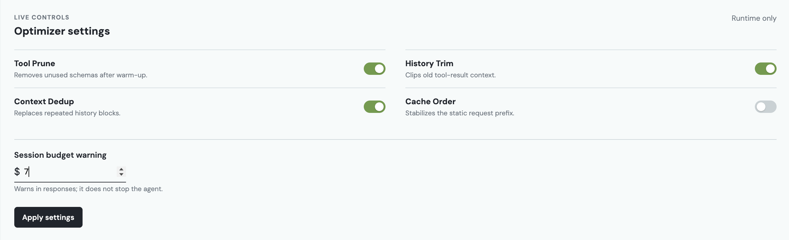
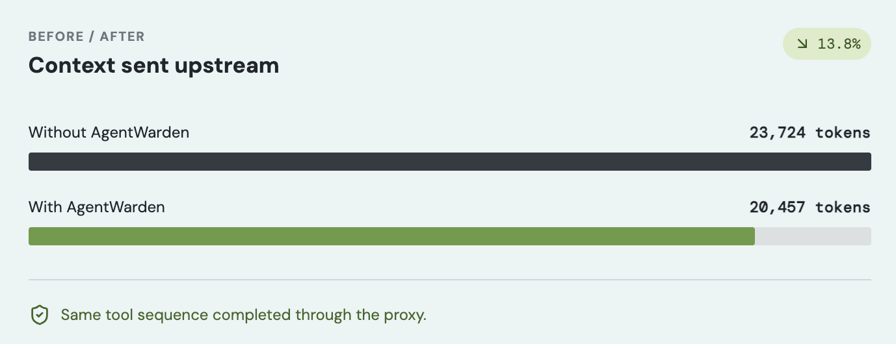
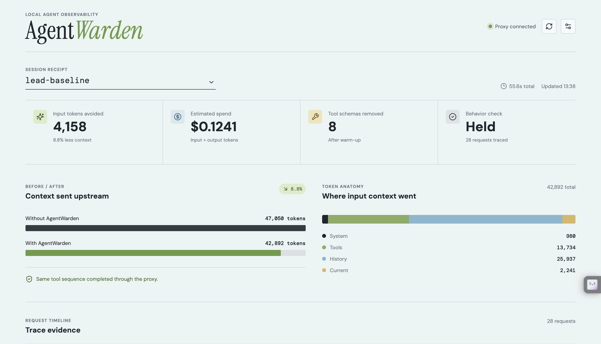

# AgentWarden

<p align="center">
  
</p>

> AgentWarden is a local, OpenAI-compatible proxy that tracks and reduces repeated context sent by tool-using agents. Your API key stays in your own agent process.

## Start here

### Important: turn the optimizers on

**Every optimizer is off by default.** After starting the dashboard, open the
top-right **settings** button, enable the four toggles, and press **Apply
settings**. They apply immediately to the running local proxy.



The controls reset when the proxy stops. For durable defaults, use the
environment variables in [Configuration](#configuration).

### 1. Install and start

Requirements: Python 3.11+ and an OpenAI API key.

```bash
python3.11 -m venv .venv
source .venv/bin/activate
pip install agentwarden-ai
agentwarden dashboard
```

This starts your local proxy and dashboard at
[http://127.0.0.1:8080/dashboard](http://127.0.0.1:8080/dashboard).

### 2. Change one line in your agent

Keep your API key exactly where it already is. Change only the OpenAI client's
base URL:

```python
from openai import OpenAI

client = OpenAI(
    api_key="your-openai-api-key",
    base_url="http://127.0.0.1:8080/v1",
)
```

Run your agent normally. Then return to the dashboard to see its request
receipt: input tokens, estimated spend, tools removed, per-segment usage, and
the optimization passes that ran.

That is the whole integration. AgentWarden supports OpenAI **Chat
Completions** clients, including streaming. It does not store API keys.

## How savings grow

Tool Prune observes the tools your agent actually calls, keeps the first three
requests unchanged, then removes unused tool schemas. The other enabled passes
clean redundant old context deterministically. In other words, AgentWarden has
more opportunity to help as an agent has a longer, repeated workflow.

For agents with repeated tool schemas and growing history, 10-15+ requests can
reduce input cost by roughly **16-50%**, depending on the toolset and context.
This is a workload-dependent range, not a guaranteed result. Always use the
local receipt and replay verifier to measure your own agent.



## The four optimizers

| Toggle | What it does |
| --- | --- |
| **Tool Prune** | After three warm-up requests, forwards only tools already used in the session or named in the current user request. |
| **History Trim** | Keeps the latest turns intact and clips older tool-result content. |
| **Context Dedup** | Replaces repeated history blocks with a deterministic reference to the earlier content. |
| **Cache Order** | Keeps the system-and-tools prefix stable so provider prompt caching has a better chance to apply. |

Every pass is independently toggleable. With all four off, AgentWarden is a
byte-identical pass-through proxy.

## Track what is happening

The dashboard is the simplest way to inspect a session. It is local and bundled
with the Python package; no Node.js or separate frontend server is required.



For a stable receipt per agent run, optionally send a session header:

```python
client.chat.completions.create(
    model="gpt-5.6-terra",
    messages=messages,
    extra_headers={"X-AgentWarden-Session": "support-agent-run-42"},
)
```

You can also query the receipt directly:

```bash
agentwarden stats --session-id support-agent-run-42
curl "http://127.0.0.1:8080/traces?session_id=support-agent-run-42"
```

## Configuration

Use these before `agentwarden dashboard` or `agentwarden serve` when you want
the settings to survive a restart:

```bash
export AGENTWARDEN_ENABLE_TOOL_PRUNE=true
export AGENTWARDEN_ENABLE_HISTORY_TRIM=true
export AGENTWARDEN_ENABLE_CONTEXT_DEDUP=true
export AGENTWARDEN_ENABLE_CACHE_ORDER=true
export AGENTWARDEN_SESSION_BUDGET_USD=0.02
agentwarden dashboard
```

| Variable | Meaning |
| --- | --- |
| `AGENTWARDEN_ENABLE_TOOL_PRUNE` | Enable unused tool-schema removal after warm-up. |
| `AGENTWARDEN_ENABLE_HISTORY_TRIM` | Enable trimming for older tool-result messages. |
| `AGENTWARDEN_ENABLE_CONTEXT_DEDUP` | Enable repeated-history cleanup. |
| `AGENTWARDEN_ENABLE_CACHE_ORDER` | Enable stable static-prefix ordering. |
| `AGENTWARDEN_SESSION_BUDGET_USD` | Add a response warning after projected session spend reaches this amount. |
| `AGENTWARDEN_DB_PATH` | SQLite receipt location; defaults to `agentwarden.sqlite3`. |

Useful commands:

```bash
agentwarden dashboard                 # dashboard + proxy on port 8080
agentwarden serve                     # proxy only on port 8080
agentwarden doctor                    # check that the local proxy is reachable
agentwarden stats --session-id NAME   # print a session receipt
agentwarden verify --no-judge         # compare the demo workflow with optimizers off vs. on
```

## Verify the project from a clone

```bash
python3.11 -m venv .venv
.venv/bin/pip install -e '.[dev]'
.venv/bin/pytest -m 'not live' -q
```

For the end-to-end demo agent:

```bash
export OPENAI_API_KEY="your-key"
.venv/bin/agentwarden demo
.venv/bin/agentwarden verify --no-judge
```

See the [user guide](docs/USING_AGENTWARDEN.md) for troubleshooting and the
[launch playbook](docs/GTM_AND_LAUNCH.md) for rollout guidance.

## Current scope

AgentWarden is a local, single-user alpha, published on PyPI as
[`agentwarden-ai`](https://pypi.org/project/agentwarden-ai/). It currently
proxies OpenAI Chat Completions only; the Responses API and non-OpenAI
providers are outside the current scope.

Created by Jahan Shah.
